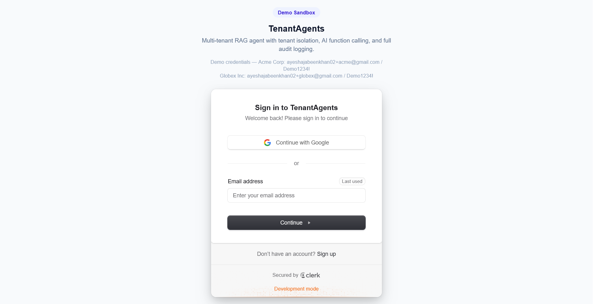
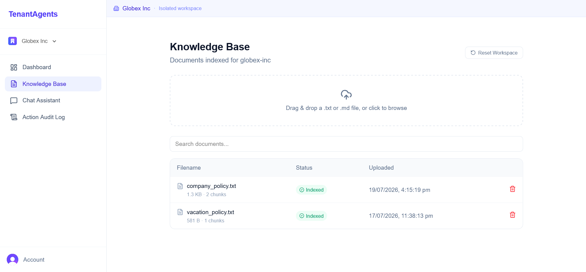
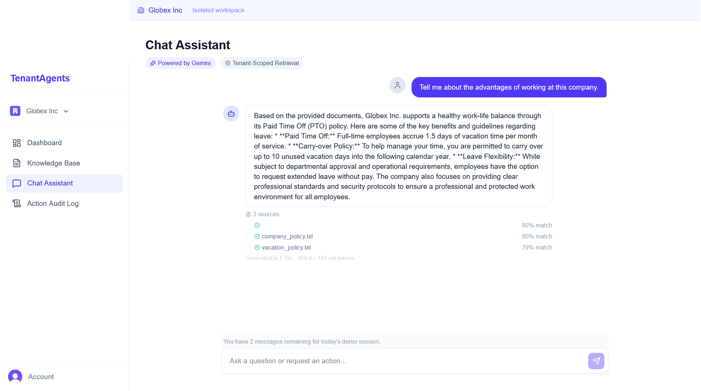
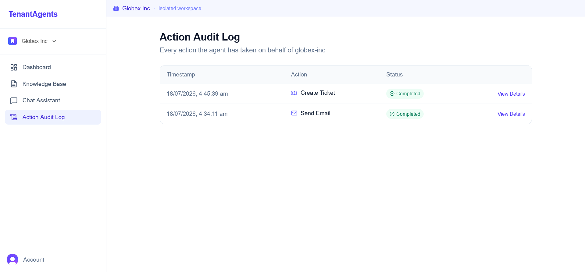
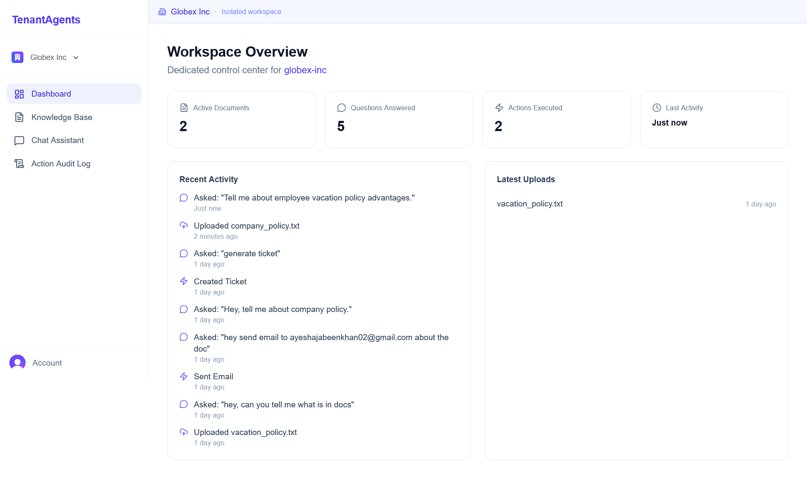

# TenantAgents

**A multi-tenant AI agent platform — each company gets its own private AI assistant that can answer questions *and* take real actions.**

> Most RAG portfolio projects are a chatbot over one PDF for one user. TenantAgents is built closer to how real SaaS products work: many companies on one platform, each one completely walled off from the others, with an AI agent that doesn't just talk — it does things.

🔗 **Live demo:** [tenantagents.vercel.app](https://tenantagents.vercel.app) 

**Demo logins** (already set up, just sign in and explore):
| Company | Email | Password |
|---|---|---|
| Acme Corp | `ayeshajabeenkhan02+acme@gmail.com` | `Demo1234!` |
| Globex Inc | `ayeshajabeenkhan02+globex@gmail.com` | `Demo1234!` |

*(Backend is on a free-tier host — the first request after it's been idle can take ~20-30 seconds to wake up.)*

Note: The source code for TenantAgents is held in a private repository to protect proprietary multi-tenant isolation logic. This repository serves as a public breakdown of the system architecture, database schema, and case study.



## Table of Contents
- [What problem this solves](#what-problem-this-solves)
- [How it works](#what-it-actually-does)
- [Tech Stack](#tech-stack)
- [Running it locally](#running-it-locally)
- [Real-world Engineering Challenges](#the-honest-unpolished-part)

## What problem this solves

Say a company wants an AI assistant that knows their internal documents — HR policies, product docs, whatever. Easy enough to build for one company. The hard part is doing it for *many* companies on the same platform, safely: Company A should never be able to see Company B's documents, chat history, or data — not even by accident, not even if there's a bug somewhere in the app.

TenantAgents is my answer to that problem — plus taking it one step further than a normal chatbot, by letting the AI actually *do* things on a company's behalf, not just answer questions.

## What it actually does

- **Each company gets its own private workspace.** Upload your own documents, chat with an AI that only knows *your* documents — never anyone else's.
- **The AI can take real actions**, not just chat. Ask it to create a support ticket or send an email, and it decides to do that on its own (using Gemini's function-calling, not a hardcoded "if user says X, do Y" script) — and every single action gets logged to an audit trail.
- **Every answer shows its work** — which source documents it used, how confident the match was (as a %), how long it took to generate, and how many tokens it used. Nothing is a black box.
- **Isolation is enforced at the database level**, not just hidden in the app's UI. Every table that holds a company's data has a `tenant_id` column, and every single query checks it — so even if there were a bug in the app logic, the data still couldn't leak across companies.

## A quick walkthrough

**1. Sign in, pick your company.** Two demo companies are ready to go — Acme Corp and Globex Inc — each with its own separate workspace.

**2. Upload documents to your Knowledge Base.** Drag and drop a `.txt` or `.md` file and it gets split into chunks, embedded, and indexed — ready to be searched.



*3. Ask the Chat Assistant anything about your documents.** It answers using *only* your company's documents, and shows exactly which sources it pulled from and how confident it was in each one.



**4. Ask it to do something — like send an email or open a ticket.** The AI decides on its own whether the request needs an action, not just an answer, and every action shows up in the Audit Log with a timestamp and status.



**5. Check the Dashboard** for a live view of what's happened in your workspace — documents uploaded, questions answered, actions taken, and recent activity.



## Tech stack

**Frontend:** Next.js (App Router), Clerk for multi-tenant login and organization switching
**Backend:** FastAPI, organized as routers → services → tools, SQLAlchemy for the database layer
**Database:** PostgreSQL with the `pgvector` extension, hosted on Neon
**AI:** Gemini — for both turning text into embeddings (search-ready vectors) and for the chat + function-calling that lets the agent decide when to take an action
**Deployment:** Frontend on Vercel, backend on Render, database on Neon — all free tier

See [architecture.md](architecture.md) for how all of this actually fits together, and why it's built this way.

## Project structure

```
tenantagents/
├── backend/
│   ├── app/
│   │   ├── db/            # models.py, session.py — SQLAlchemy layer
│   │   ├── middleware/    # tenant-scoping middleware
│   │   ├── routers/       # audit.py, chat.py, documents.py, stats.py
│   │   ├── schemas/       # Pydantic request/response models
│   │   ├── services/
│   │   │   ├── tools/     # create_ticket.py, send_email.py — agent actions
│   │   │   ├── agent.py       # Gemini function-calling logic
│   │   │   ├── chunking.py    # document splitting
│   │   │   ├── embeddings.py  # Gemini embeddings
│   │   │   ├── retrieval.py   # pgvector similarity search
│   │   │   └── usage.py       # rate-limit tracking
│   │   └── tests/
│   ├── seed_data/
│   ├── requirements.txt
│   └── Dockerfile
├── frontend/
│   └── src/
│       ├── app/
│       │   ├── [tenant]/          # per-company workspace routes
│       │   ├── select-org/
│       │   ├── sign-in/ , sign-up/
│       │   └── layout.tsx, page.tsx
│       ├── components/
│       │   ├── ActionAuditLog.tsx
│       │   ├── ChatWindow.tsx
│       │   ├── DocumentList.tsx
│       │   ├── DocumentUploader.tsx
│       │   ├── ResetButton.tsx
│       │   ├── Sidebar.tsx
│       │   ├── TenantHeader.tsx
│       │   └── TenantOrganizationSwitcher.tsx
│       ├── lib/            # api.ts, chat.ts, demoSession.ts
│       └── middleware.ts
├── docs/
│   └── architecture.md
└── screenshots/
```

## Running it locally

```bash
# Backend
cd backend
python -m venv venv && source venv/Scripts/activate   # venv/bin/activate on macOS/Linux
pip install -r requirements.txt
cp .env.example .env   # set DATABASE_URL, GEMINI_API_KEY, CLERK keys
uvicorn app.main:app --reload

# Frontend
cd frontend
npm install
npm run dev
```

## The honest, unpolished part

Getting a demo running on your own laptop is maybe 40% of actually shipping something. Here's the real debugging that ate most of the time — the boring, half-hour-of-searching-logs kind of problems that make up most of real engineering work:

- **A mystery infinite request loop, only in dev.** Spent an evening on this before realizing OneDrive was silently syncing my project folder, which kept re-triggering Next.js's file watcher every second. Lesson: never run a dev project out of a synced folder.
- **A 404 loading Clerk's own script, only in production.** My middleware's path matcher was accidentally excluding the exact path Clerk needs to proxy its script through. One regex fix.
- **"Unable to attribute this request to a Clerk instance."** Turns out Clerk's production tier needs a custom domain you actually control — a free Vercel subdomain doesn't qualify. I switched to Clerk's development instance instead of buying a domain I didn't need yet at this stage — same functionality, zero cost.
- **Redesigned how agent actions work, three times.** First version wired actions through n8n (an external automation tool) to fire real Slack messages. Eventually cut it — for a portfolio project, that was an external dependency adding complexity without adding real value over a simple internal audit trail. Sometimes the best engineering decision is the feature you *don't* ship.

None of these were genuinely hard problems. They're just the normal texture of building something real, and I'd rather show that than pretend it worked on the first try.

## What I'd build differently at scale (and can speak to in an interview)

- Document processing is currently synchronous (upload → chunk → embed → ready, in one request). At scale, this would move to a background job queue so large files don't block the request.
- Chat messages are logged individually rather than grouped into named conversation threads yet.
- Clerk runs on its free development tier rather than a production instance tied to a custom domain — a small, deliberate cost I deferred rather than a technical limitation.

## Author

Built end-to-end by **Ayesha Jabeen Khan**.
