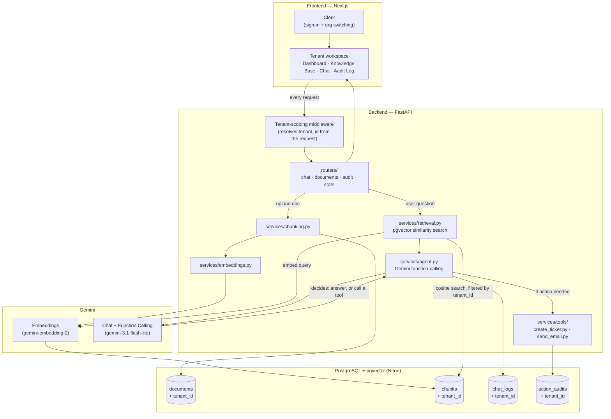

# Architecture

This document explains how TenantAgents actually works under the hood — how a question turns into an answer, how an action gets taken, and why tenant isolation holds even if something else in the app goes wrong.

Note: The source code for TenantAgents is held in a private repository to protect proprietary multi-tenant isolation logic. This repository serves as a public breakdown of the system architecture, database schema, and case study.

## The big picture

## Walking through a single question

Say someone on Globex Inc's team asks the Chat Assistant: *"Tell me about the vacation policy."*

1. **The request hits the tenant-scoping middleware first.** Before any business logic runs, the middleware figures out which tenant (Globex Inc) this request belongs to, based on the signed-in user's organization. That tenant ID travels with the request from here on.
2. **The question gets embedded.** The backend calls Gemini's embedding model to turn the question into a vector — a list of numbers that captures its meaning.
3. **Retrieval searches only Globex Inc's documents.** Using `pgvector`'s cosine distance search, the backend finds the most similar document chunks — but the query is filtered by `tenant_id = globex-inc` first. Acme Corp's documents are never even considered; they're not just hidden from the results, they're excluded from the search itself.
4. **The agent decides what to do.** The retrieved chunks and the question go to Gemini's chat model. Gemini decides: does this need a plain answer, or does the user actually want an action taken (like "create a ticket about this")? This decision is made by the model itself through function-calling — it's not a hardcoded keyword match.
5. **If it's just a question**, Gemini writes an answer grounded in the retrieved chunks, and the response includes which sources were used, a similarity score for each, how long it took, and token usage.
6. **If it's an action**, the agent calls the matching tool (`create_ticket.py` or `send_email.py`), that tool executes, and the result is written to the `action_audits` table — timestamp, action type, payload, status — so there's a permanent record of exactly what the AI did and when.
7. **Everything gets logged** to `chat_logs`, tagged with the same `tenant_id`, so the conversation history for Globex Inc stays completely separate from any other company's.

## How tenant isolation actually holds

This is the part that matters most in a multi-tenant system, so it's worth being explicit about it.

**Every table that holds tenant data has its own `tenant_id` column** — `documents`, `chunks`, `chat_logs`, `action_audits` — and **every single query that touches these tables filters by `tenant_id` directly**, even on tables that also happen to have a foreign key to something already tenant-scoped. That second part matters: if isolation only relied on a join to a parent table, one missing join anywhere in the codebase could leak data. By checking `tenant_id` at every query, one bug in one place doesn't compromise the whole system — there's no single point of failure for isolation.

This is sometimes called **defense-in-depth**: multiple independent layers all enforcing the same rule, so that a mistake in any one layer doesn't break the guarantee.

## A few specific design decisions worth knowing

**Asymmetric embeddings for documents vs. questions.**
Gemini's embedding model performs noticeably better when you tell it whether it's embedding a stored document or a search query — these are two different "framings" baked into the prompt sent to the embedding model (`retrieval_document` vs `retrieval_query`). Using the same framing for both stored chunks and incoming questions gives measurably worse search results, so the two paths are handled differently on purpose.

**Rate limiting lives on each endpoint, not in a global middleware.**
Instead of one central place that quietly limits everything, each endpoint that needs a rate limit declares it explicitly as a FastAPI dependency — visible right in that endpoint's own code. This keeps limits easy to find and reason about per-endpoint, instead of hidden logic that's easy to forget exists.

**Agent actions don't go through an external automation tool.**
An earlier version routed agent actions (like sending a Slack notification) through n8n, an external workflow automation platform. This was removed — for a project at this stage, it added an external dependency and a hosting requirement without adding real value over a simple, synchronous, internal audit log. The lesson here isn't "n8n is bad" — it's that adding a dependency should earn its place, and removing one you don't need is just as much a real engineering decision as adding one.

**Document processing is synchronous, on purpose, for now.**
Upload → chunk → embed → ready to search all happens within a single request. This is simpler to reason about and totally fine at demo scale. The natural next step for handling much larger files without blocking the request would be to move this to a background job queue — a change in infrastructure, not in the core logic.

## Tech stack by layer

| Layer | Technology |
|---|---|
| Frontend | Next.js (App Router), Clerk (multi-tenant auth + org switching) |
| Backend API | FastAPI, organized as routers → services → tools |
| Retrieval | PostgreSQL + `pgvector`, cosine similarity search |
| Embeddings | Gemini `gemini-embedding-2` (3072-dimensional vectors) |
| Chat + agent actions | Gemini `gemini-3.1-flash-lite`, function-calling |
| Database | PostgreSQL, hosted on Neon |
| Deployment | Vercel (frontend), Render (backend) |
